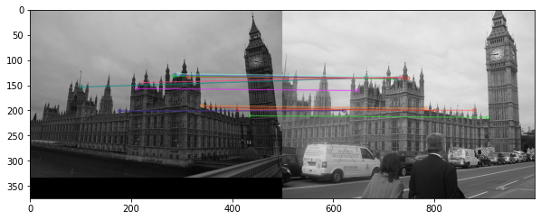
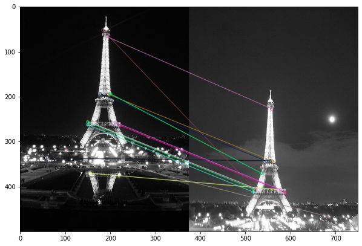
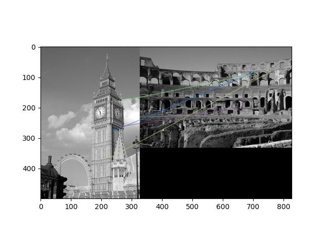
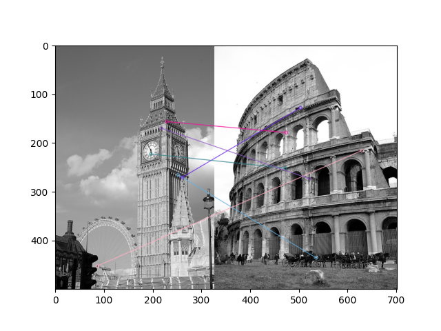

# part1.py Procedure
## Steps Taken:

- Calculate ORB features using openCV library, take Keypoints and Descriptors of these features
- Calculate top two similar matches using `KnnMatch()`
- Filter only significant matches using threshold value
- Generate a similarity matrix using number of matches between two images that are below the threshold 
- Apply scaling and `PCA`
- Used KMeans Clustering
- Calculate the performance of the model
- Output the result in `output.txt` file

## Experiments:

#### Feature Matching
- We first wrote matching number of features using different distance metric such as hamming distance and euclidean distance
- White the results were decent, it was too slow to compare each image with each other
- Finally, we decided to use `BFMatcher` and `KnnMatch` to calculate the top two similar matches of features

#### Clustering
- We tried various clustering algorithms but none of them gave good engouh results
- Tried Agglomerative Clustering but result was around 0.60
- Used Spectral Clustering and the results was around 0.58
- Evaluated result on Kmeans as well but that was quite worse than Agglomerative and Spectral, around 0.51
- So we decided to convert the matrix using `StandardScalar` using sklearn, Applied `PCA` using sklearn
- Then I tried Agglomerative clustering on resultant data and the result was not good, around 0.45 which is expected
- Similarly, I tried Spectral clustering and even that performend worse as expected
- Then we tried KMeans that gave us the best results, fluctuating between **0.74** and **0.81**

## Results:

We achieved the accuracy of around **0.74** and **0.81**

In terms of Feature Matching, the result were good in some images but some were very bad. Below is the example of How some results were good and some were bad,

#### CASE 1: Correct Detection

#### CASE 2: Correct Detection

#### CASE 3: Incorrect Detection

#### CASE 4: Incorrect Detection

Though the result was quite good, the accuracy could have been improved by using more complex data for clustering other than just simple distance matrix. One trend we noticed in clustering was that a lot of images were gathering in the same cluster which might be because of the image type. More exploration is required to learn more about this behavior.